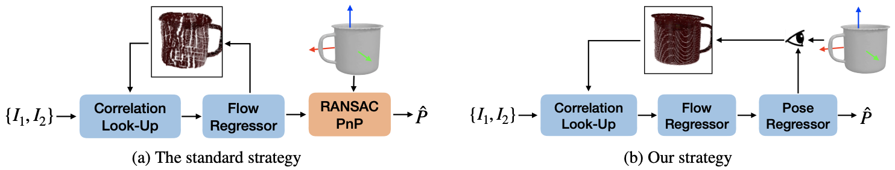

<h1 align="center"> Shape-Constraint Recurrent Flow for 6D Object Pose Estimation (CVPR 2023) </h1>
<h5 align="center"><a href="https://yanghai-1218.github.io">Yang Hai</a>, Rui Song, Jiaojiao Li, <a href="https://yinlinhu.github.io">Yinlin Hu</a></h5>
<p align="center">
  <a href="https://arxiv.org/abs/2306.13266">Paper</a> |
  <a href="https://yanghai-1218.github.io/publications/SCFlow-Poster.png">Poster</a> |
  <a href="https://www.youtube.com/watch?v=wLba5ED_TS4&t=12s">Video</a>
</p>


# Introduction
Most recent 6D object pose methods use 2D optical flow to refine their results. However, the general optical flow methods typically do not consider the target’s 3D shape information during matching, making them less effective in 6D object pose estimation. In this work, we propose a shape-constraint recurrent matching framework for 6D ob- ject pose estimation.

<figure>

<figcaption align = "center"><b>Figure 1. Different pose refinement paradigms. </b>(a) Most pose refinement methods rely on a recurrent architecture to estimate dense 2D flow between the rendered image I<sub>1</sub> and the real input image I<sub>2</sub>, based on a dynamically-constructed correlation map according to the flow results of the previous iteration. After the convergence of the flow network and lifting the 2D flow to a 3D-to-2D correspondence field, they use PnP solvers to compute a new refined pose. This strategy, however, has a large matching space for every pixel in constructing correlation maps, and optimizes a surrogate matching loss does not reflect the final 6D pose estimation tasl. (b) By contrast, we propose optimizing the pose and flow simultaneously in an end-to-end recurrent framework with the guidance of the target's 3D shape. We impose a shape constraint on the correlation map construction by forcing the construction to comply with the target’s 3D shape, which reduces the matching space significantly. Furthermore, we propose learning the object pose based on the current flow prediction, which, in turn, helps the flow prediction and yields an end-to-end system for object pose
 </figcaption>
</figure>


<figure>

<figcaption align = "center"><b>Figure 3. Overview of our shape-constraint recurrent framework.</b> After building a 4D correlation volume between the rendered image and the input target image, we use GRU to predict an intermediate flow, based on the predicted flow F<sub>k−1</sub> and the hidden state h<sub>k−1</sub> of GRU from the previous iteration. We then use a pose regressor to predict the relative pose ∆P<sub>k</sub> based on the intermediate flow, which is used to update the previous pose estimation P<sub>k−1</sub>. Finally, we compute a pose-induced flow based on the displacement of 2D reprojection between the initial pose and the currently estimated pose P<sub>k</sub> . We use this pose-induced flow to index the correlation map for the following iterations, which reduces the matching space significantly. Here we show the flow and its corresponding warp results in the dashed boxes. Note how the intermediate flow does not preserve the shape of the target, but the pose-induced flow does.
 </figcaption>
</figure>

## Installation
This code has been tested on a `ubuntu 18.04` server with `CUDA 11.3`
- Install necessary packages by `pip install -r requirements.txt`
- Install `pytorch3d` by building this [pytorch3d project](https://github.com/YangHai-1218/pytorch3d)

## Dataset Preparation
- Download YCB-V dataset from the [BOP website](https://bop.felk.cvut.cz/) and place it under the `data/ycbv` directory.
- Download [image lists](https://drive.google.com/drive/folders/1VD8QmXS38hrAUfp2MSnxXuEJLdzPtZvV?usp=share_link) and place them under the `data/ycbv/image_lists` directory.
- Download [PoseCNN initial pose](https://drive.google.com/drive/folders/1VD8QmXS38hrAUfp2MSnxXuEJLdzPtZvV?usp=share_link) and place it under `data/initial_poses/ycbv_posecnn` directory.
## Training
- Download the RAFT pretrained model from mmflow and convert the checkpoint.
    ```shell
    python tools/mmflow_ckpt_converter.py --model_url https://download.openmmlab.com/mmflow/raft/raft_8x2_100k_flyingthings3d_400x720.pth
    ```
- Replace the `_base_` in the `configs/refine_models/scflow.py` with different training setting in `configs/refine_datasets`.
- Use `train.py`.
    ```shell
    python train.py --config configs/refine_models/scflow.py
    ```

## Testing

Evaluate the performance.

```shell
python test.py --config configs/refine_models/scflow.py --checkpoint *** --eval
```

Save the results.
```shell
python test.py --config configs/refine_models/scflow.py  --checkpoint *** --format-only --save-dir ***
```

## Pretrained Models
We put the pretrained models under different training settings at [here](https://drive.google.com/drive/folders/1tyXhx7z5AJpyj925_g0W6DjeNbt6Lj3_?usp=share_link).
## Citation

If you find our project is helpful, please cite:

```
@inproceedings{yang2023scflow,
    title={Shape-Constraint Flow for 6D Object Pose Estimation},
    author={Yang, Hai and Rui, Song and Jiaojiao, Li and Yinlin, Hu},
    booktitle={Proceedings IEEE Conf. on Computer Vision and Pattern Recognition (CVPR)},
    year={2023}}
```

## Acknowledgement
We build this project based on [mmflow](https://github.com/open-mmlab/mmflow), [GDR-Net](https://github.com/THU-DA-6D-Pose-Group/GDR-Net), and [PFA](https://github.com/cvlab-epfl/perspective-flow-aggregation). We thank the authors for their great code repositories.