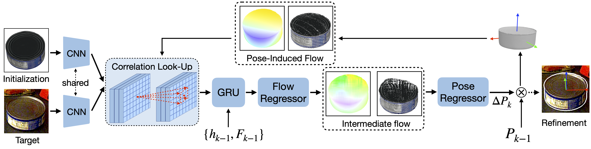

# SCFlow
This is the offical code for [''Shape-Constraint Flow for 6D Object Pose Estimation'']()(accepted by CVPR 2023).

[Yang Hai](https://yanghai-1218.github.io), Rui Song, Jiaojiao Li and  [Yinlin Hu](https://yinlinhu.github.io)


<div align="center">
    
    <em>
      Different pose refinement paradigms. (a) Most pose refinement methods rely on a recurrent architecture t o estimate dense 2D flow between the rendered image I1 and the real input image I2, based on a dynamically-constructed correlation map according to the flow results of the previous iteration. After the convergence of the flow network and lifting the 2D flow to a 3D-to-2D correspondence field, they use PnP solvers to compute a new refined pose Pˆ. This strategy, however, has a large matching space for every pixel in constructing correlation maps, and optimizes a surrogate matching loss does not reflect the final 6D pose estimation tasl. (b)Bycontrast, we propose optimizing the pose and flow simultaneously in an end-to-end recurrent framework with the guidance of the target's 3D shape. We impose a shape constraint on the correlation map construction by forcing the construction to comply with the target’s 3D shape, which reduces the matching space significantly. Furthermore, we propose learning the object pose based on the current flow prediction, which, in turn, helps the flow prediction and yields an end-to-end system for object pose. </em>
</div>


## Installation
This code has been tested on a `ubuntu 18.04` server with `CUDA 11.3`
- Install necessary packages by `pip install -r requirements.txt`
- Install `pytorch3d` by building this [pytorch3d project](https://github.com/YangHai-1218/pytorch3d)

## Dataset Preparation
- Download YCB-V dataset from the [BOP website](https://bop.felk.cvut.cz/) and place it under the `data/ycbv` directory.
- Download [image lists](https://drive.google.com/drive/folders/1VD8QmXS38hrAUfp2MSnxXuEJLdzPtZvV?usp=share_link) and place them under the `data/ycbv/image_lists` directory.
- Download [PoseCNN initial pose](https://drive.google.com/drive/folders/1VD8QmXS38hrAUfp2MSnxXuEJLdzPtZvV?usp=share_link) and place it under `data/initial_poses/ycbv_posecnn` directory.
## Training
- Download the RAFT pretrained model from mmflow and convert the checkpoint.
    ```shell
    python tools/mmflow_ckpt_converter.py --model_url https://download.openmmlab.com/mmflow/raft/raft_8x2_100k_flyingthings3d_400x720.pth
    ```
- Replace the `_base_` in the `configs/refine_models/scflow.py` with different training setting in `configs/refine_datasets`.
- Use `train.py`.
    ```shell
    python train.py --config configs/refine_models/scflow.py
    ```

## Testing

Evaluate the performance.

```shell
python test.py --config configs/refine_models/scflow.py --checkpoint *** --eval
```

Save the results.
```shell
python test.py --config configs/refine_models/scflow.py  --checkpoint *** --format-only --save-dir ***
```

## Pretrained Models
We put the pretrained models under different training settings at [here](https://drive.google.com/drive/folders/1tyXhx7z5AJpyj925_g0W6DjeNbt6Lj3_?usp=share_link).
## Citation

If you find our project is helpful, please cite:

```
@inproceedings{yang2023scflow,
    title={Shape-Constraint Flow for 6D Object Pose Estimation},
    author={Yang, Hai and Rui, Song and Jiaojiao, Li and Yinlin, Hu},
    booktitle={Proceedings IEEE Conf. on Computer Vision and Pattern Recognition (CVPR)},
    year={2023}}
```

## Acknowledgement
We build this project based on [mmflow](https://github.com/open-mmlab/mmflow), [GDR-Net](https://github.com/THU-DA-6D-Pose-Group/GDR-Net), and [PFA](https://github.com/cvlab-epfl/perspective-flow-aggregation). We thank the authors for their great code repositories.